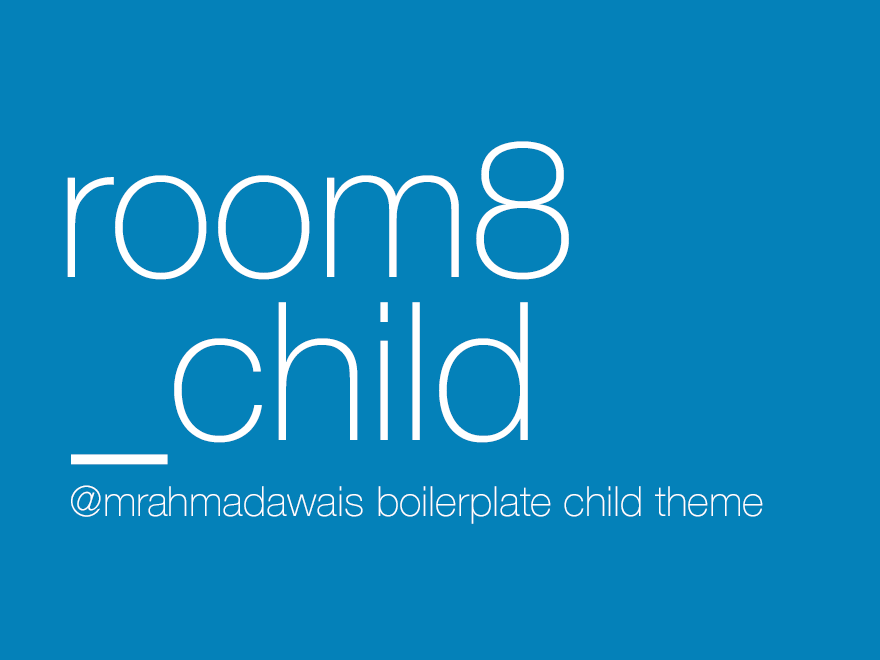

## _child ( aka. Underscore_Child )

_child is a A WordPress Child Theme Boilerplate! by [Ahmad Awais](http://AhmadAwais.com/about/)

## Files

It includes:
- **style.css** which has a tag template for the parent name.
- **functions.php** which enqueues the style.css of parent theme and then style.css of `_child`.

[Read More](https://ahmadawais.com/_child-wordpress-child-theme-boilerplate/)
### License
_child is licensed under GPL v2.0 and is distributed as is.

---
### 🙌 [WPCOUPLE PARTNERS](https://WPCouple.com/partners):
This open source project is maintained by the help of awesome businesses listed below. What? [Read more about it →](https://WPCouple.com/partners)
